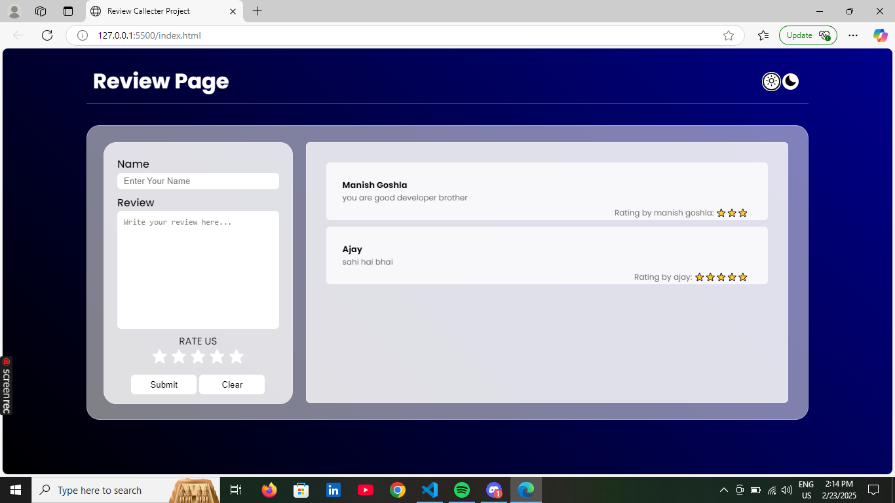

# ⭐ Review Collector Project

A simple web application to collect user reviews with star ratings. Built using HTML, CSS, and JavaScript.

## 🚀 Features

- 🌟 Star rating system (1 to 5 stars)
- ✍️ Collect user name and review text
- 📋 Display submitted reviews dynamically
- 🔄 Clear form functionality

## 📷 Preview

## Demo Video

## 🛠️ Technologies Used

- HTML5
- CSS3
- JavaScript
